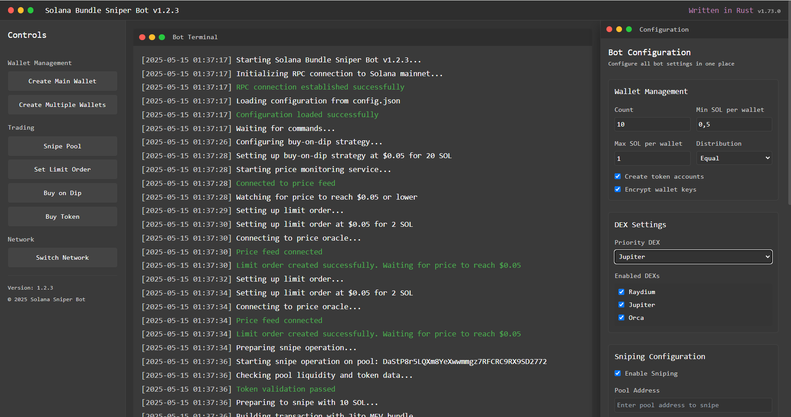

# Solana Bundle Sniper Bot 🚀

Welcome to the **Solana Bundle Sniper Bot**! 🎉 This is the ultimate tool for Solana token creators and traders who want to snipe liquidity pools, automate swaps, and manage their token like a pro-all while staying under the radar. Built for tokens with $100k+ liquidity, this bot gives you full control with features like bundle transactions, limit orders, and stealthy wallet management. Let's make waves in the Solana ecosystem! 🌊

<p align="center"></p>

---

## ✨ Key Features

- **Bundle Transactions with Jito MEV** 🛠️
Snipe your token's liquidity pool in the same block as its creation using Jito bundle transactions. Be the first to grab your share!

- **Custom Wallet Creation** 🔑
Generate multiple Solana wallets with tailored parameters (count, SOL balance, token accounts) for stealthy trading and bundle compatibility.

- **Choose Your DEX** 🏦
Trade on Raydium, Jupiter, or Orca-or all at once! Pick your DEX or let the bot optimize routes for the best prices and lowest slippage.

- **Limit Orders for Smart Trading** 📉
Set price thresholds to buy your token when it's cheap (e.g., ≤ $0.05) or sell at a profit. Perfect for scooping up tokens on dips.

- **Buy Low on Market Dips** 📊
Automatically buy your token when prices hit your target (e.g., $0.05), spreading trades across wallets to stabilize the market discreetly.

- **Multi-Wallet Management** 🔐
Manage multiple wallets to distribute buys/sells, making trades look like regular trader activity to avoid suspicion.

- **Automated Swaps with Risk Management** 📈
Automate trades with Stop Loss, Take Profit, and slippage control (20-40%) on your chosen DEX.

- **Real-Time Blockchain Monitoring** 👀
Track new pools, whale moves, and contract changes in real-time with Bitquery and Solana RPC. Stay ahead of the game!

- **Honeypot & Rug Pull Protection** 🛡️
Filters check for LP burn, freeze authority, and sketchy contracts to keep your funds safe.

- **User-Friendly Interface** 💻
Control everything via a web dashboard or Telegram bot (coming soon!). No coding skills needed!

- **Stealth Mode** 🕵️♂️
Spread trades across wallets, DEX, and randomized delays to mimic organic activity. Ideal for token creators who want control without raising eyebrows.

- **Local Key Storage** 🔒
Your private keys stay encrypted on your machine. No cloud, no leaks!

---

## 🛠️ Installation

---

## 🚀 Usage

Configure the bot via the web dashboard or `config.json`. Here's how to set it up.

### 1. Configure Your Strategy
Edit `config.json` to set up wallets, sniping, trading, and DEX preferences:
```json
{
"wallets": {
"count": 10,
"min_sol_per_wallet": 0.5,
"max_sol_per_wallet": 1.0,
"distribution": "random",
"create_token_accounts": true,
"rotate_interval_hours": 24,
"encrypt": true
},
"dex": {
"enabled": ["raydium", "jupiter", "orca"],
"priority": "jupiter"
},
"snipe": {
"enabled": true,
"pool_address": "YOUR_TOKEN_POOL_ADDRESS",
"bundle_enabled": true,
"max_buy_amount": 10,
"slippage": 30
},
"limit_orders": {
"enabled": true,
"buy_price_max": 0.05,
"sell_price_min": 0.10,
"volume_per_order": 2,
"timeout_hours": 24
},
"buy_on_dip": {
"enabled": true,
"target_price": 0.05,
"max_volume": 20,
"distribute_wallets": true
},
"risk_management": {
"check_lp_burn": true,
"check_freeze_authority": true,
"stop_loss": 10,
"take_profit": 20
}
}
```

- **wallets**:
- `count`: Number of wallets to create (e.g., 10).
- `min_sol_per_wallet`/`max_sol_per_wallet`: SOL range for each wallet.
- `distribution`: `"random"` or `"equal"` for SOL allocation.
- `create_token_accounts`: Auto-create ATA for your token.
- `rotate_interval_hours`: Rotate active wallets every X hours.
- `encrypt`: Encrypt wallet keys with `ENCRYPTION_KEY`.
- **dex**: Choose DEX and set priority.
- **limit_orders**: Buy/sell at specific prices.
- **buy_on_dip**: Buy when price hits your target.

### 2. Create Wallets
Generate wallets with custom parameters:
```bash
npm run create-wallets
```
This creates 10 wallets (per `config.json`), each with 0.5-1.0 SOL, token accounts, and encrypted keys saved to `wallets.json`.

### 3. Snipe a New Pool
To snipe your token's pool:
1. Set `pool_address` in `config.json`.
2. Enable `bundle_enabled`.
3. Run:
```bash
npm run snipe
```

### 4. Set Up Limit Orders
To buy/sell at specific prices:
1. Enable `limit_orders` and set `buy_price_max`/`sell_price_min`.
2. Run:
```bash
npm run limit-order
```

### 5. Buy on Dips
To buy when prices drop:
1. Enable `buy_on_dip` and set `target_price`.
2. Run:
```bash
npm run buy-on-dip
```

### 6. Monitor Activity
Check `http://localhost:3000` for logs like:
```
[2025-05-15 01:11:23] 🔑 Created 5 wallets with 0.5-1.0 SOL each
[2025-05-15 01:11:24] 🚀 Sniped pool: 10 SOL bought at $0.074 via Jupiter
[2025-05-15 01:11:25] 📉 Limit order triggered: Bought 7 SOL at $0.052 on Raydium
[2025-05-15 01:11:26] 📊 Dip detected: Bought 2 SOL at $0.055 across 5 wallets
```


---

## 🛡️ Security Notes

- **Never share your `.env` or `wallets.json`.** Encrypted keys are safe, but keep backups secure.
- Use a custom RPC endpoint for speed and reliability.
- Audit your token's contract with SolanaFM or Dexscreener.
- Test on Solana devnet before mainnet to avoid losses.
---

## 🌟 Acknowledgments

- Big thanks to the Solana community for awesome docs and tools! 🙏
- Inspired by Smithii Sniper, Trojan, and Jupiter.
- Powered by `@solana/web3.js`, Raydium SDK, and Jito Labs.

Let's dominate the Solana DEX game together! 🌊
